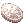
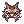
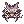
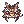

---
hide:
  - toc
---

# ⚔️ PvP Arena

{ .wiki-screenshot }

**PvP Arena** is a daily tournament system where players compete for Arena Coins, weekly ranking
rewards, and eternal glory in the Hall of Fame. Four sessions run every day with rotating maps.

## Schedule

| Session | Time (GMT) | Duration |
|---------|------------|----------|
| **1** | `02:00` | 45 min |
| **2** | `08:00` | 45 min |
| **3** | `14:00` | 45 min |
| **4** | `22:00` | 45 min |

Maps rotate each session.

## Participation

| Requirement | Detail |
|-------------|--------|
| **Level** | Base Level `80+` |
| **Capacity** | Max `50` players per arena |
| **Allowed Consumables** | White Potion, Blue Potion, Condensed White Potion, and Siege Potions |
| **Blocked Consumables** | All other healing items (food, herbs, candies, juices, stat dishes, etc.) |
| **MVP Cards** | Disabled in arena |
| **Combat Scrolls** | Blocked (Endure, Kyrie, Pneuma, Safety Wall, etc.) |
| **Re-entry Delay** | `30 seconds` after death |

**Commands:** `@pvparena` to view arena status and schedule, `@arenarank` to check rankings

## Scoring

| Action | Points |
|--------|--------|
| **Kill** | `+10` (adjusted ±1% per level difference, clamped 70–130%) |
| **Death** | `-3` |
| **Disconnect** | `-3` + `30-second` re-entry delay |

### Anti-Abuse

- `60-second` kill cooldown per victim
- Max `3` scoring kills on the same player per session
- No points for ±15 level gap or party members

!!! warning "Zero Tolerance for Abuse"
    All matches and player data are tracked and logged. Despite the anti-abuse system, any attempt
    to bypass or exploit it without reporting will result in a **permanent ban** — no exceptions.

##  Arena Coins

- Earn `1` coin per `2` points (minimum `15` coins guaranteed)
- Session winner receives `+20` bonus coins
- Delivered via **RODEX** after each session

## Weekly Season Rewards

!!! info "Weekly Season Rewards"
    Top 3 players at weekly reset (Monday 00:00) receive Dragon Helm costumes:

    - **#1** —  **Gold Dragon Helm** (`5451`)
    - **#2** —  **Silver Dragon Helm** (`5452`)
    - **#3** —  **Copper Dragon Helm** (`5453`)

    Dragon Helm rewards are purely cosmetic (stat bonuses have been removed).

    Champion statues in Prontera display the top 3 with animated appearances.

{ .wiki-screenshot }
