# Repeatable Quests

Field NPCs across Rune-Midgard will trade you EXP for the loot you've gathered or the monsters you've cleared, as many times as you like. Pick up the quest on your way out to a hunting spot and it pays you back for the grind.

!!! info "Quick Facts"
    - **Quest Types:** Item turn-in and monster hunting
    - **Level Required:** From Level 2, depending on the NPC
    - **Rewards:** Base and Job EXP
    - **Repeatable:** As often as you like
    - **Turn-In Amounts:** 20, 25 or 50 items
    - **Hunt Sizes:** 50, 100 or 150 monsters

## How It Works

- **Every NPC has a level range.** The Level column in each list shows it.
- **Some NPCs offer both quest types.** You can accept both, but if they come from the same NPC, finish or abandon the monster hunt before you turn in items.
- **Turn-ins pay per item.** Hand over the full amount in one go to receive the EXP in the list.
- **Hunts pay per kill.** Defeat the monsters and every kill counts, no drops needed.
- **Hunt sizes pay the same per kill.** A 100-monster hunt gives twice the EXP of a 50-monster hunt, and a 150-monster hunt gives three times as much.
- **Party kills are shared.** Party members on the killer's screen share the kill count, as long as the one who lands the final blow is visible.
- **Mercenary kills count, Homunculus kills don't.**
- **You can hold a quest and finish it later.** Accept it, become a Transcendent, then claim the reward once you meet the minimum level.

## Item Turn-In Quests

Item quests ask you to collect **20**, **25** or **50** of a specific item. Collected items are worth more than the quest: you can trade or sell them to other players, or save them to boost future characters.

| NPC | Location | Level | Items | Base EXP | Job EXP | Base EXP Per Item | Job EXP Per Item |
|:---|:---|:---:|:---|---:|---:|---:|---:|
| Langry | `/navi gef_fild07 321/193` | 2–20 | 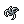 25 Fluff | 770 | 60 | 30 | 2 |
| Halgus | `/navi gef_fild04 191/54` | 2–20 | 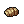 25 Chrysalis | 770 | 60 | 30 | 2 |
| Gregor | `/navi moc_fild02 74/329` | 10–30 | 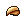 25 Bill of Birds | 8,000 | 4,000 | 320 | 160 |
| Laertes | `/navi prt_fild04 356/148` | 15–45 | 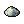 25 Powder of Butterfly | 5,900 | 2,250 | 236 | 90 |
| Nutters | `/navi mjolnir_01 293/20` | 18–60 | 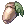 25 Acorn | 7,200 | 7,810 | 288 | 312 |
| Yullo | `/navi mjolnir_01 296/29` | 24–60 | 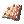 25 Porcupine Quill | 20,850 | 12,544 | 834 | 510 |
| Private Jeremy | `/navi moc_fild11 57/138` | 25–60 | 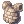 25 Stone Heart | 28,000 | 18,000 | 1,120 | 720 |
| Shone | `/navi moc_fild17 208/346` | 25–60 | 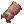 25 Earthworm Peeling | 39,438 | 28,120 | 1,577 | 1,124 |
| Lemly | `/navi moc_fild17 66/273` | 30–65 | 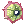 25 Frill | 60,000 | 46,000 | 2,400 | 1,840 |
| Li | `/navi pay_fild10 108/357` | 35–70 |  50 Dokebi Horn | 84,000 | 72,000 | 1,680 | 1,440 |
| Lella | `/navi ayo_fild01 44/241` | 36–65 |  50 Huge Leaf | 51,480 | 63,024 | 1,029 | 1,260 |
| Cuir | `/navi cmd_fild01 362/256` | 45–80 | 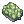 20 Anolian Skin | 137,900 | 86,600 | 6,895 | 4,330 |
| Local Villager | `/navi ein_fild01 43/249` | 60–74 |  50 Bacillus | 500,532 | 288,904 | 10,010 | 5,778 |
| Lilla | `/navi um_fild01 35/281` | 60–85 |  50 Sharp Leaf | 524,970 | 283,670 | 10,499 | 5,673 |
| Vegetable Farmer | `/navi ein_fild06 82/171` | 70–85 | 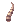 50 Antelope Horn | 516,978 | 310,310 | 10,339 | 6,206 |

### Item Purchase Locations

Some turn-in items can be bought directly from NPCs.

- **Bill of Birds:** Morroc Ruins (`/navi moc_ruins 81/113`, `/navi moc_ruins 93/53`)
- **Acorn:** Acorn Dealer in Moscovia (`/navi moscovia 208/182`)
- **Antelope Horn:** Tool Dealer in Niflheim (`/navi niflheim 218/197`)

!!! note
    Antelope Horns can't be bought with the Discount skill and can't be vended to other players.

## Monster Hunting

Hunting quests let you choose to defeat **50**, **100** or **150** monsters. A 50-monster hunt can grant up to **1 Base Level** and **1 Job Level**, while 100 and 150 hunts can grant up to **2** and **3 levels**. They're especially effective in parties, and a good excuse to explore new maps and meet a wider variety of monsters.

!!! tip
    Picked the wrong hunt size? Abandon the quest to reset it and choose again. You lose all current progress.

### Hunting Quest List

!!! note
    The rewards listed are for a **50-monster** hunt. Double the values for 100 monsters and triple them for 150. Monsters marked with **\***{ .quest-flag } are on maps that require a quest to access.

| NPC | Location | Level | Monster | Base EXP | Job EXP | Base EXP Per Monster | Job EXP Per Monster |
|:---|:---|:---:|:---|---:|---:|---:|---:|
| Langry | `/navi gef_fild07 321/193` | 2–20 |  Fabre | 770 | 60 | 15 | 1 |
| Halgus | `/navi gef_fild04 191/54` | 2–20 | 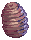 Pupa | 770 | 60 | 15 | 1 |
| Gregor | `/navi moc_fild02 74/329` | 10–30 |  Peco Peco | 8,000 | 4,000 | 160 | 80 |
| Laertes | `/navi prt_fild04 356/148` | 15–45 |  Creamy | 5,900 | 2,250 | 118 | 45 |
| Nutters | `/navi mjolnir_01 293/20` | 18–60 |  Coco | 7,200 | 7,810 | 144 | 156 |
| Yullo | `/navi mjolnir_01 296/29` | 24–60 |  Caramel | 20,850 | 12,544 | 417 | 251 |
| Private Jeremy | `/navi moc_fild11 57/138` | 25–60 |  Golem | 28,000 | 18,000 | 560 | 360 |
| Shone | `/navi moc_fild17 208/346` | 25–60 |  Hode | 31,550 | 22,500 | 631 | 450 |
| Lemly | `/navi moc_fild17 66/273` | 30–65 | 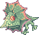 Frilldora | 60,000 | 46,000 | 1,200 | 900 |
| Li | `/navi pay_fild10 108/357` | 35–70 |  Dokebi | 84,000 | 72,000 | 1,680 | 1,440 |
| Lella | `/navi ayo_fild01 44/241` | 36–65 |  Leaf Cat | 51,480 | 63,024 | 1,029 | 1,260 |
| Cuir | `/navi cmd_fild01 362/256` | 45–80 | 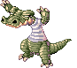 Alligator | 137,900 | 86,600 | 6,895 | 4,330 |
| Gandolf | `/navi lhz_dun01 146/287` | 45–80 |  Remover **\***{ .quest-flag } | 550,000 | 340,000 | 11,000 | 6,800 |
| Local Villager | `/navi ein_fild01 43/249` | 60–74 | 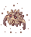 Demon Pungus | 500,532 | 288,904 | 10,010 | 5,778 |
| Lilla | `/navi um_fild01 35/281` | 60–85 | 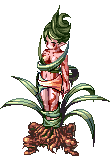 Dryad | 524,970 | 283,670 | 10,499 | 5,673 |
| Shea | `/navi tur_dun03 125/195` | 60–85 | 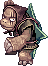 Assaulter **\***{ .quest-flag } | 850,000 | 550,000 | 17,000 | 11,000 |
| Vegetable Farmer | `/navi ein_fild06 82/171` | 70–85 |  Goat | 1,033,956 | 620,620 | 20,680 | 12,413 |
| Henry | `/navi ice_dun03 140/26` | 70–95 |  Ice Titan | 3,640,000 | 2,600,000 | 72,800 | 52,000 |
| Monica | `/navi geffen 112/63` | 70–98 |  Succubus **\***{ .quest-flag } | 5,300,000 | 3,800,000 | 106,000 | 76,000 |
| Coal Miner | `/navi mag_dun02 46/40` | 75–97 | 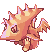 Deleter | 1,550,936 | 930,932 | 31,019 | 18,619 |
| Jotun Tribesman | `/navi mag_dun01 127/71` | 75–97 |  Lava Golem | 1,939,200 | 1,162,800 | 38,784 | 23,256 |
| Miner | `/navi beach_dun 269/71` | 75–97 |  Medusa | 2,062,800 | 1,409,100 | 41,256 | 28,182 |
| Ptero | `/navi abyss_03 117/31` | 75–97 |  Gold Acidus **\***{ .quest-flag } | 2,570,000 | 1,630,000 | 51,400 | 32,600 |
| Kirby | `/navi nyd_dun01 146/154` | 75–98 |  Draco **\***{ .quest-flag } | 3,700,000 | 2,800,000 | 74,000 | 56,000 |
| Emmerich | `/navi thor_v03 57/245` | 75–98 |  Salamander **\***{ .quest-flag } | 8,600,000 | 6,200,000 | 172,000 | 124,000 |

